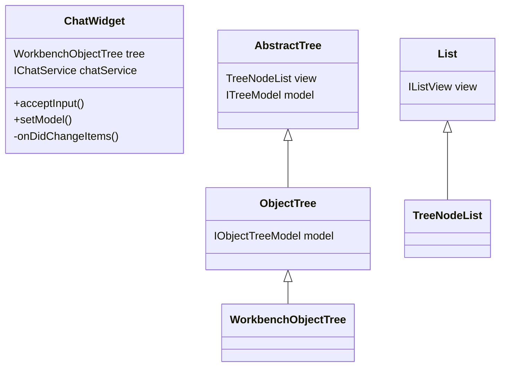
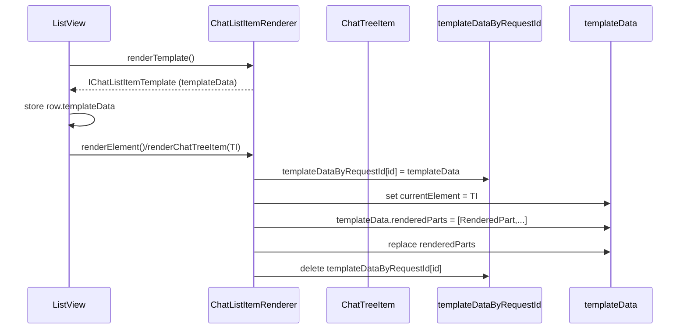
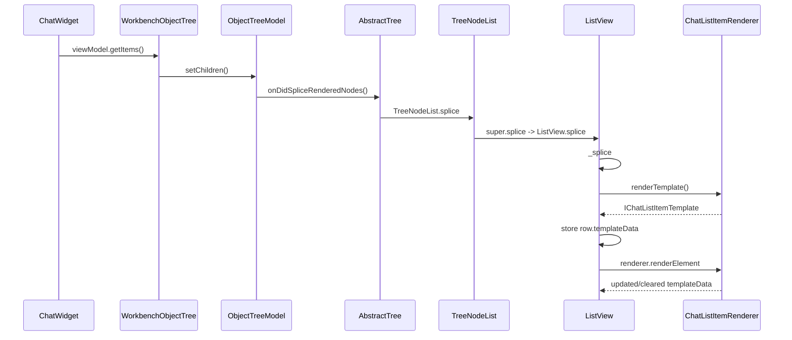
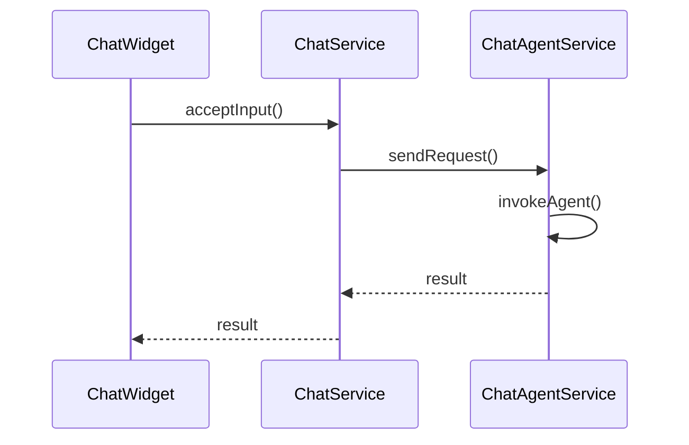
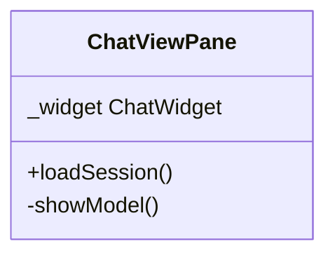

# Chat View Overview

- ChatWidget の createList で ChatListItemRenderer が生成される. 他色々.
-

## ChatWidget から ListView への経路

`ChatWidget` の `createList` から `WorkbenchObjectTree` を生成し、レンダラー／デリゲート／コンテナを渡してツリー UI を組み立てる。

## ListView の items は chatWidget からどのような経路で変更されるか

ChatWidget 側では `viewModel` から `treeItems` を作って `ChatWidget.tree.setChildren(null, treeItems, …)`

## renderer と templateDate

- `templateData` は `IChatListItemTemplate` で定義された「1行あたりの DOM＋状態」の束で、現在アタッチされている `ChatTreeItem` やそのために構築されたツールバー・ヘッダー・アバター・コンテキストキー・ツールチップ・再利用可能な `renderedParts`（マークダウンやツール呼び出しなどの描画パート）を保持する仕組みです（[src/vs/workbench/contrib/chat/browser/chatListRenderer.ts#L102-L129](src/vs/workbench/contrib/chat/browser/chatListRenderer.ts#L102-L129)）。
- このテンプレートはリストが行を作るときに `renderTemplate` で DOM を初期化し、`renderElement`／`renderChatTreeItem` で `ChatTreeItem` を注入するときに使われます。`renderTemplate` が各行の DOM・ツールバー・エレメント／イベントリスナを構築し、`renderElement` がそのテンプレートを `delegate.getListLength()` に合わせて現在の要素で更新する役割を担います（[src/vs/workbench/contrib/chat/browser/chatListRenderer.ts#L349-L666](src/vs/workbench/contrib/chat/browser/chatListRenderer.ts#L349-L666)）。
- `templateData` 自体は `templateDataByRequestId` マップにも保存されていて、`renderChatTreeItem` 内で各要素の `id` をキーに設定・上書きされます（`currentElement` を更新し、マップにも登録したあと、同じテンプレートを別要素で使うときに以前の参照を `clearRenderedParts` でリセットします）。過去にバインドされたテンプレートが不要になると `disposeElement` でマップから削除され、イベントなども解放されます（[src/vs/workbench/contrib/chat/browser/chatListRenderer.ts#L153-L1760](src/vs/workbench/contrib/chat/browser/chatListRenderer.ts#L153-L1760)）。
- `templateData` の内容は `renderChatTreeItem` で `currentElement` と CSS 状態を更新し、`renderChatResponseBasic`/`renderChatRequest`・`renderChatContentDiff` などで `renderedParts` を差分描画（必要に応じて `clearRenderedParts`/`dispose`）するたびに置き換わります。たとえばリクエスト描画時は `templateData.renderedParts` に新しいパーツ配列をセットし、レスポンスのプログレッシブ描画中は `renderChatContentDiff` で `renderedParts` を差し替えて DOM を更新しています（[src/vs/workbench/contrib/chat/browser/chatListRenderer.ts#L520-L899](src/vs/workbench/contrib/chat/browser/chatListRenderer.ts#L520-L899)）。

## templateData のながれ

- ChatWidget が `viewModel.getItems()` で `ChatTreeItem` のリストを作り、`this.tree.setChildren(null, treeItems, …)` で `WorkbenchObjectTree` に渡すところから描画が始まります。ここで “差分の ID を設定したツリー要素” を `ObjectTree` に流しているので、新規要素／更新要素がモデルに登録され、リストの再レンダリングがトリガーされます。[chatWidget.ts#L804-L859](src/vs/workbench/contrib/chat/browser/chatWidget.ts#L804-L859)
- `ObjectTree.setChildren` は単にモデルに委譲するだけなので、その段階では `ObjectTreeModel` が新しい要素群を記録します。[objectTree.ts#L40-L86](src/vs/base/browser/ui/tree/objectTree.ts#L40-L86)
- `AbstractTree` の `setupModel` がそのモデルの `onDidSpliceRenderedNodes` を監視し、差分イベントを `view.splice`（= `TreeNodeList.splice`）に渡します。`TreeNodeList` は `List` サブクラスで、差分を `super.splice` 経由で `ListView.splice` まで流し、フォーカス/選択の Trait も更新します。[abstractTree.ts#L2474-L2538](src/vs/base/browser/ui/tree/abstractTree.ts#L2474-L2538)／[abstractTree.ts#L3199-L3242](src/vs/base/browser/ui/tree/abstractTree.ts#L3199-L3242)
- `ListView` は `items: IItem<T>[]` という配列で現在の DOM 行を管理し、`splice` → `_splice` で差分を反映します。新しい要素を挿入するたびに `virtualDelegate.getTemplateId` で renderer を決め、`row.templateData` を保持した `IRow` を再利用しながら DOM を差し替えます。また `_splice` 中で既存 `row.templateData` を `renderer.disposeElement` に渡して解放する仕組みにより、テンプレート情報を `ListView` が握りながら renderer に受け渡し続けます。[listView.ts#L290-L340](src/vs/base/browser/ui/list/listView.ts#L290-L340)／[listView.ts#L617-L700](src/vs/base/browser/ui/list/listView.ts#L617-L700)
- つまり `templateData` は `ChatListItemRenderer.renderTemplate` で作られた後、`ListView.items` の対応する `row`（`IRow.templateData`）として保持され、差分が入るたびに `ListView.splice`→`renderer.renderElement()/disposeElement()` 経路で更新・破棄されています。これが “テンプレートデータが ListView に保存され、必要なときに renderer に渡される” 経路です。

## Agent への request から結果の表示まで

ChatWidget から agent の返答が表示されるまでの流れは次の順番です：

1. `ChatWidget.acceptInput()` -> `ChatWidget.chatService.sendRequest()`

2. `ChatAgentService.invokeAgent()` を呼び出し、`progressCallback` がプログレスパーツを受け取るたびに `ChatModel.acceptResponseProgress()` を叩いてデータを蓄積し、最終的に `model.setResponse()` で結果を確定します。[src/vs/workbench/contrib/chat/common/chatAgents.ts#L480-L548] [src/vs/workbench/contrib/chat/common/chatModel.ts#L2116-L2184]
   これにより `ChatModel` が `addResponse`/`completedRequest` イベントを発火し、ファイル変化・コードブロックなども記録します。[src/vs/workbench/contrib/chat/common/chatModel.ts#L2116-L2184]

3. `ChatViewModel` → `ChatWidget` のリフレッシュ
   `ChatViewModel` は `ChatModel.onDidChange` を監視し、リクエストやレスポンスが追加されるたびに内部 `_items` を更新し、対応する `ChatResponseViewModel` の `onDidChange` で `viewModel.onDidChange` を発火します。[src/vs/workbench/contrib/chat/common/chatViewModel.ts#L287-L352]

## Load session

過去のセッションを読み込むと、`ChatViewPane.showModel()`が `this._widget.setModel(model)` を呼ぶ. UI をまるごと差し替え、履歴と状態が再構築されます。

- [`setModel`](src/vs/workbench/contrib/chat/browser/chatWidget.ts#L1970) はまず `model` が `undefined` なら `viewModel` をクリアしてリストを再描画、同じセッションなら何もしません。
- [`ChatWidget.onDidChangeItems()`](src/vs/workbench/contrib/chat/browser/chatWidget.ts#L884) で items の変更と
- ツリーが表示中であれば `onDidChangeItems()` → `scrollToEnd()` でリスト再構築と末尾表示を保証し、レンダラーと入力コンテキストを新しい `viewModel` に切り替え、TODO リストウィジェットも描画します。

