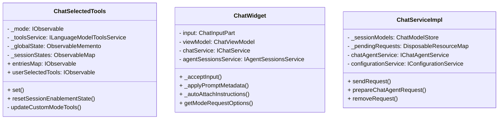
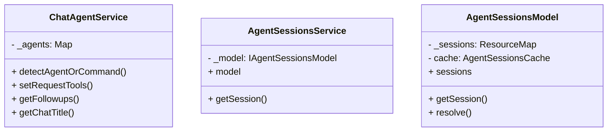
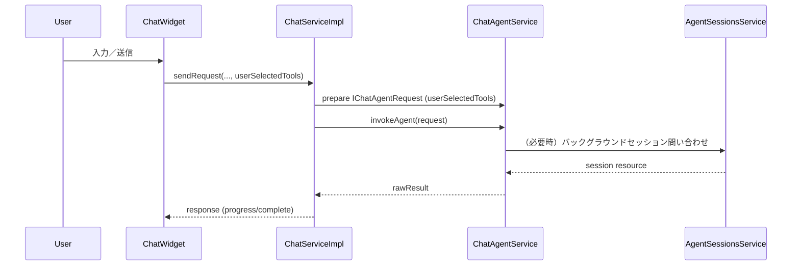
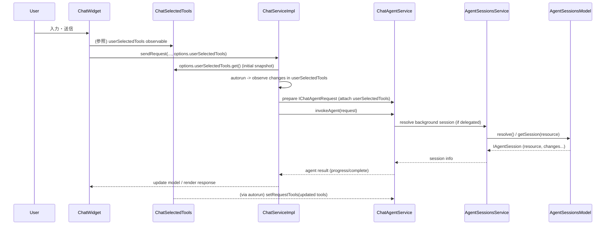

## User

- background 実行の agent の tool はどのように設定されるか。ユーザの選択が反映されていないようだ。
- background 実行の git worktree dir を取得する API。ほかの方法があるか。

## Assistant

以下は今回のセッションでの調査結果と出力の要約です。

- ツール選択のフロー
	- UI 側でのツール管理は `ChatSelectedTools` が担い、`entriesMap` -> `userSelectedTools`（Record<string, boolean>）に変換される。[src/vs/workbench/contrib/chat/browser/chatSelectedTools.ts](src/vs/workbench/contrib/chat/browser/chatSelectedTools.ts#L153-L156)
	- `ChatWidget#getModeRequestOptions()` が送信オプションに `userSelectedTools` を含める。[src/vs/workbench/contrib/chat/browser/chatWidget.ts](src/vs/workbench/contrib/chat/browser/chatWidget.ts#L2364-L2368)
	- `ChatServiceImpl.prepareChatAgentRequest` は `options?.userSelectedTools?.get()` を `IChatAgentRequest.userSelectedTools` に転写し、さらに `autorun` で後からの変更を監視して `chatAgentService.setRequestTools` を呼ぶので、バックグラウンド実行でも変更が反映される仕組みになっている。[src/vs/workbench/contrib/chat/common/chatServiceImpl.ts](src/vs/workbench/contrib/chat/common/chatServiceImpl.ts#L872-L923)

- バックグラウンドセッションのワークツリー情報
	- `AgentSessionsModel` の `IAgentSession` に `resource: URI` が含まれており、`AgentSessionsService.getSession(resource)` でセッション情報を取得できる。[src/vs/workbench/contrib/chat/browser/agentSessions/agentSessionsModel.ts](src/vs/workbench/contrib/chat/browser/agentSessions/agentSessionsModel.ts#L41-L47)
	- 現状、専用の "worktree dir API" は見当たらず、セッションの `resource`（例: `copilotcli://...` のような scheme を含む URI）からワークツリーパスやメタデータを解釈するのが実務的な手法。

- リモート/バックグラウンド代理エージェント
	- `remoteCodingAgents` 拡張点と `RemoteCodingAgentsService` が利用可能。利用可能なエージェント一覧や `command` を登録・取得できる。[src/vs/workbench/contrib/remoteCodingAgents/common/remoteCodingAgentsService.ts](src/vs/workbench/contrib/remoteCodingAgents/common/remoteCodingAgentsService.ts)

---

### Assistant 出力（図）

以下は本セッションで生成した Mermaid 図です（要約版）。

---

## 参照ファイル

- [src/vs/workbench/contrib/chat/browser/chatSelectedTools.ts](src/vs/workbench/contrib/chat/browser/chatSelectedTools.ts#L153-L156) — ツール選択の observable と保存ロジック
- [src/vs/workbench/contrib/chat/browser/chatWidget.ts](src/vs/workbench/contrib/chat/browser/chatWidget.ts#L2364-L2368) — `getModeRequestOptions()`（`userSelectedTools` を送信オプションに含める）
- [src/vs/workbench/contrib/chat/common/chatServiceImpl.ts](src/vs/workbench/contrib/chat/common/chatServiceImpl.ts#L872-L923) — `prepareChatAgentRequest` と `autorun` によるツール更新の伝播
- [src/vs/workbench/contrib/chat/browser/agentSessions/agentSessionsModel.ts](src/vs/workbench/contrib/chat/browser/agentSessions/agentSessionsModel.ts#L41-L47) — `IAgentSession` に `resource: URI` を含む
- [src/vs/workbench/contrib/chat/browser/agentSessions/agentSessionsService.ts](src/vs/workbench/contrib/chat/browser/agentSessions/agentSessionsService.ts#L11-L18) — `getSession(resource)` API
- [src/vs/workbench/contrib/remoteCodingAgents/common/remoteCodingAgentsService.ts](src/vs/workbench/contrib/remoteCodingAgents/common/remoteCodingAgentsService.ts) — リモートコーディングエージェントの登録/取得サービス

