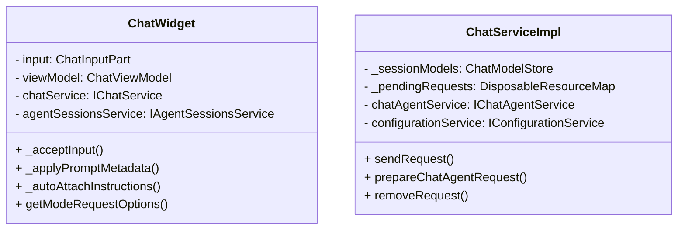
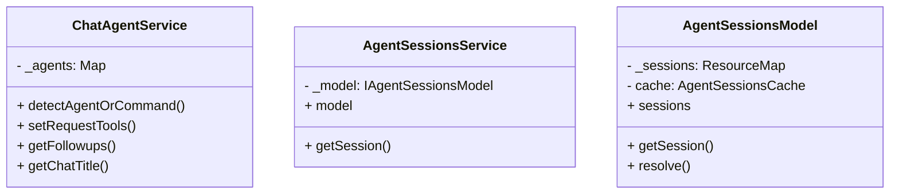
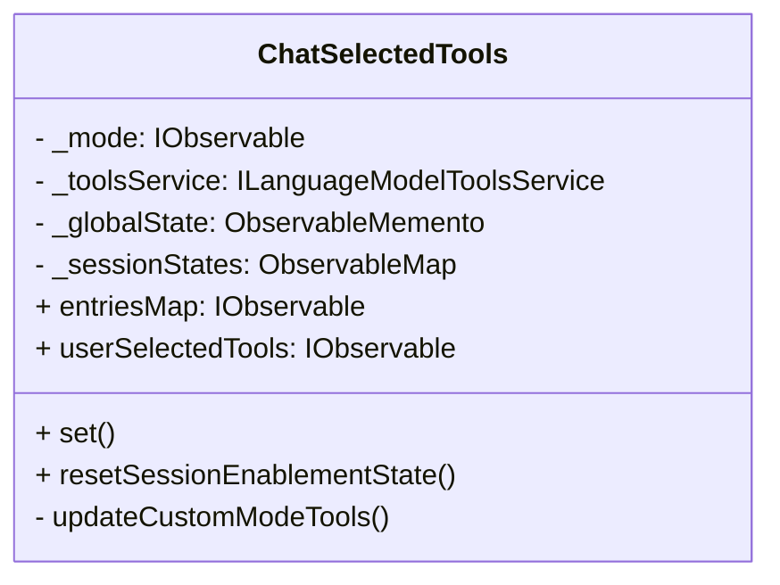
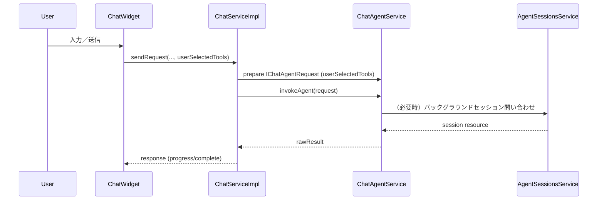
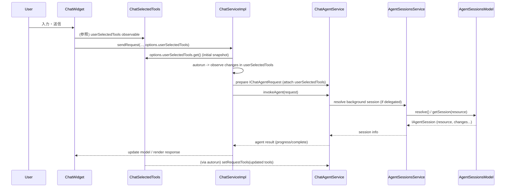

## User

- background 実行の agent の tool はどのように設定されるか。ユーザの選択が反映されていないようだ。
- background 実行の git worktree dir を取得する API。ほかの方法があるか。
- agent のバックグラウンド実行の全体フローを、ユーザ入力から chat view での通知まで徹底的に調査してほしい。

## Assistant

以下はこのセッションで行った調査の要約、図、および参照です。

- バックグラウンドセッションのワークツリー情報
  - `AgentSessionsModel` の `IAgentSession` に `resource: URI` が含まれ、`AgentSessionsService.getSession(resource)` からセッション情報を取得できる。
  - リポジトリのワークツリーパスを直接返す専用 API は見当たらないため、現実的にはセッションの `resource`（例: `copilotcli://...` のようなスキームを含む URI）からワークツリーパスやメタデータを解釈して利用する方法が実務的。

- リモート／バックグラウンド代理エージェント
  - `remoteCodingAgents` 拡張点と `RemoteCodingAgentsService` により、リモートのコーディングエージェントを登録・列挙・利用できる。

- 実行フロー（要点）
  - `ChatWidget._acceptInput` が入力を収集し、添付コンテキストを含めて `chatService.sendRequest(...)` を呼ぶ。
  - `ChatServiceImpl._sendRequestAsync` は `ChatRequestModel` を作成し、必要に応じて `chatAgentService.detectAgentOrCommand` で参加者検出を行い、エージェント実装を `chatAgentService.invokeAgent` で呼び出す。
  - エージェントからの進捗は `progressCallback` 経由で `ChatModel.acceptResponseProgress` に送り、最終結果は `ChatModel.setResponse` で確定される。UI は `ChatViewModel` が `ChatModel` の変化を監視して更新される。
  - 送信時に `CancellableRequest` が `_pendingRequests` に登録され、キャンセル時は関連するツール呼び出しが取り消され、トークンがキャンセルされる。

- ツール選択のフロー
  - UI 側のツール管理は `ChatSelectedTools` が担う。`entriesMap` が `userSelectedTools`（Record<string, boolean> 相当の observable）に変換され、ユーザ選択が保持される。
  - `ChatWidget#getModeRequestOptions()` で `userSelectedTools` を送信オプションに含める設計になっている。
  - `ChatServiceImpl.prepareChatAgentRequest` は初期スナップショットとして `options?.userSelectedTools?.get()` を `IChatAgentRequest.userSelectedTools` に転写し、さらに `autorun` で後続の変更を監視して `chatAgentService.setRequestTools` を呼ぶため、バックグラウンド実行中でもツール選択の変更が反映される仕組みになっている。

### Assistant 出力（図）

## 参照ファイル

- [src/vs/workbench/contrib/chat/browser/chatSelectedTools.ts](src/vs/workbench/contrib/chat/browser/chatSelectedTools.ts) — ツール選択の observable と保存ロジック
- [src/vs/workbench/contrib/chat/browser/chatWidget.ts](src/vs/workbench/contrib/chat/browser/chatWidget.ts) — `ChatWidget`：入力収集と `sendRequest` 呼び出し、送信オプションの作成
- [src/vs/workbench/contrib/chat/common/chatServiceImpl.ts](src/vs/workbench/contrib/chat/common/chatServiceImpl.ts) — `ChatServiceImpl`：リクエスト作成、エージェント呼び出し、進捗/完了の流し込み、キャンセル管理
- [src/vs/workbench/contrib/chat/common/chatAgents.ts](src/vs/workbench/contrib/chat/common/chatAgents.ts) — `ChatAgentService` のエージェント登録／呼び出しロジック（参照用）
- [src/vs/workbench/contrib/chat/browser/agentSessions/agentSessionsModel.ts](src/vs/workbench/contrib/chat/browser/agentSessions/agentSessionsModel.ts) — セッションモデル（`IAgentSession.resource` を含む）
- [src/vs/workbench/contrib/chat/browser/agentSessions/agentSessionsService.ts](src/vs/workbench/contrib/chat/browser/agentSessions/agentSessionsService.ts) — セッション取得 API（`getSession`）
- [src/vs/workbench/contrib/remoteCodingAgents/common/remoteCodingAgentsService.ts](src/vs/workbench/contrib/remoteCodingAgents/common/remoteCodingAgentsService.ts) — リモートコーディングエージェントの登録/取得サービス

