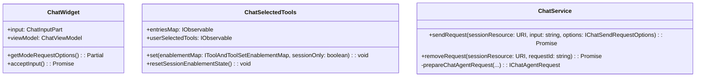
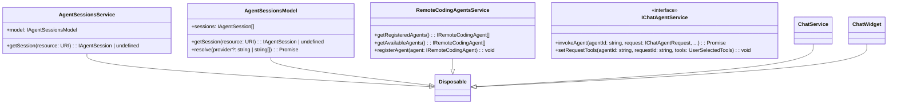
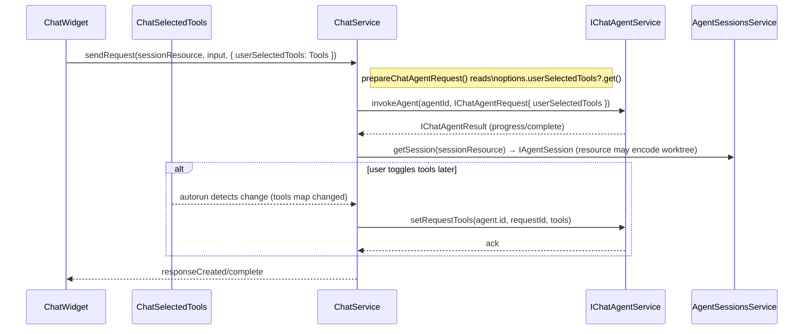

## 会話要約

**User**

- バックグラウンド実行される agent のツール設定がどのように反映されるかを確認したい。ユーザ選択が反映されていないように見える点を調査すること。
- バックグラウンド実行される agent に紐づく git worktree のディレクトリを取得する API（または別手段）を知りたい。
- 上記の仕組みを可視化する Mermaid 図（少なくとも1つの classDiagram と 1つの sequenceDiagram）を作成してほしい。図は中程度に省略し、継承は矢印のみで表現、インスタンス変数とメソッドを明記すること。
- これまでのチャットセッションの要約を `living_doc/agentbackground.md` に追記してほしい（本ファイル）。

**Assistant**

- 調査内容の要点
	- ツール選択は `ChatSelectedTools` の `userSelectedTools`（Observable）として表現され、`ChatWidget#getModeRequestOptions()` がこれを読み取って `sendRequest` のオプションに含める。
	- `ChatServiceImpl`（chatServiceImpl.ts 内）は、`prepareChatAgentRequest` 経由でオプションの `userSelectedTools` を `IChatAgentRequest.userSelectedTools` に転写する。同クラス内で `autorun` を用いて後続の変更を監視し、変更時に `chatAgentService.setRequestTools` を呼んで実行中リクエストへ反映している。
	- バックグラウンドセッションのメタ情報は `AgentSessionsModel` / `AgentSessionsService` 経由で管理され、各 `IAgentSession` は `resource: URI` を持つ。ワークツリーに相当する情報はこの `resource` にエンコードされている（専用 API はなく、プロバイダが URI に含めて提供する想定）。

- 提供した成果物
	- 簡略化したクラス図（2ブロック）を作成：主要クラス（`ChatWidget`、`ChatSelectedTools`、`ChatService`、`AgentSessionsService`、`AgentSessionsModel`、`RemoteCodingAgentsService`、`IChatAgentService` 等）と主要メソッド／プロパティを記載。
	- 送信フローのシーケンス図（abridged）を作成：`ChatWidget` → `ChatService` → `IChatAgentService` 呼び出し、`userSelectedTools` の初期転写と後続の `autorun` による `setRequestTools` 呼び出しまでを示す。
	- 関連ソースの参照リンク（ファイルパス）を図の下に添付。

**参照ファイル一覧（会話で参照した主要パスと簡単説明）**

- [src/vs/workbench/contrib/chat/browser/chatSelectedTools.ts](src/vs/workbench/contrib/chat/browser/chatSelectedTools.ts#L153): ユーザが選択したツールの Observable（`userSelectedTools`）定義と保存スコープ処理。
- [src/vs/workbench/contrib/chat/browser/chatWidget.ts](src/vs/workbench/contrib/chat/browser/chatWidget.ts#L2364): `getModeRequestOptions()` が `userSelectedTools` を送信オプションに含める箇所。
- [src/vs/workbench/contrib/chat/common/chatServiceImpl.ts](src/vs/workbench/contrib/chat/common/chatServiceImpl.ts#L872): `prepareChatAgentRequest` と送信フロー。`userSelectedTools` の初期転写と `autorun` による更新反映箇所。
- [src/vs/workbench/contrib/chat/browser/agentSessions/agentSessionsModel.ts](src/vs/workbench/contrib/chat/browser/agentSessions/agentSessionsModel.ts#L41): `IAgentSession` の定義（`resource: URI` を含む）とセッションモデル。
- [src/vs/workbench/contrib/chat/browser/agentSessions/agentSessionsService.ts](src/vs/workbench/contrib/chat/browser/agentSessions/agentSessionsService.ts#L11): `AgentSessionsService.getSession(resource)` の公開 API。
- [src/vs/workbench/contrib/chat/browser/agentSessions/agentSessions.ts](src/vs/workbench/contrib/chat/browser/agentSessions/agentSessions.ts#L15): セッションプロバイダ種別（例: `copilotcli` が Background）とアイコン定義。
- [src/vs/workbench/contrib/chat/browser/agentSessions/localAgentSessionsProvider.ts](src/vs/workbench/contrib/chat/browser/agentSessions/localAgentSessionsProvider.ts#L1): ローカルセッションプロバイダの例（チャットモデル監視と履歴取得）。
- [src/vs/workbench/contrib/remoteCodingAgents/common/remoteCodingAgentsService.ts](src/vs/workbench/contrib/remoteCodingAgents/common/remoteCodingAgentsService.ts#L31): リモートコーディングエージェント登録・可用性管理。
- [src/vs/workbench/contrib/chat/browser/chatSessions.contribution.ts](src/vs/workbench/contrib/chat/browser/chatSessions.contribution.ts#L760): `chatSessions` 拡張ポイント周り（セッションプロバイダ取得と解決フロー）。
- `living_doc/agentbackground.md`（本ファイル）: 本要約を追記したファイル。

## Mermaid 図

### Class Diagram — Part 1

### Class Diagram — Part 2

### Sequence Diagram — sendRequest (abridged)

### 図の参照ソース

- `ChatSelectedTools` / `userSelectedTools`: [src/vs/workbench/contrib/chat/browser/chatSelectedTools.ts](src/vs/workbench/contrib/chat/browser/chatSelectedTools.ts#L153)
- `ChatWidget#getModeRequestOptions`: [src/vs/workbench/contrib/chat/browser/chatWidget.ts](src/vs/workbench/contrib/chat/browser/chatWidget.ts#L2364)
- `ChatServiceImpl.prepareChatAgentRequest` と `autorun`: [src/vs/workbench/contrib/chat/common/chatServiceImpl.ts](src/vs/workbench/contrib/chat/common/chatServiceImpl.ts#L872)
- `IAgentSession.resource`（ワークツリー情報）: [src/vs/workbench/contrib/chat/browser/agentSessions/agentSessionsModel.ts](src/vs/workbench/contrib/chat/browser/agentSessions/agentSessionsModel.ts#L41)
- `AgentSessionsService.getSession`: [src/vs/workbench/contrib/chat/browser/agentSessions/agentSessionsService.ts](src/vs/workbench/contrib/chat/browser/agentSessions/agentSessionsService.ts#L11)
