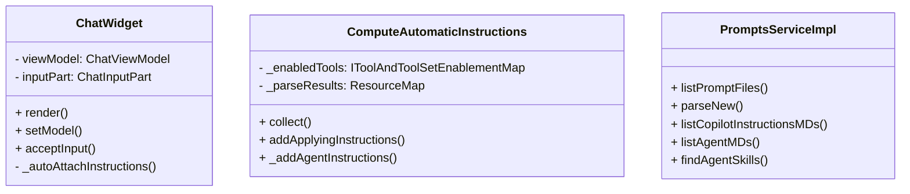
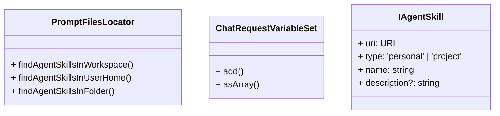
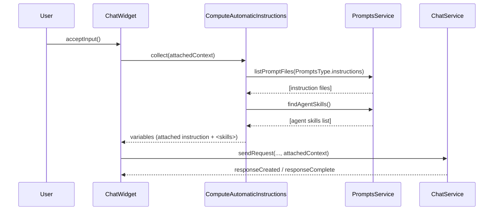
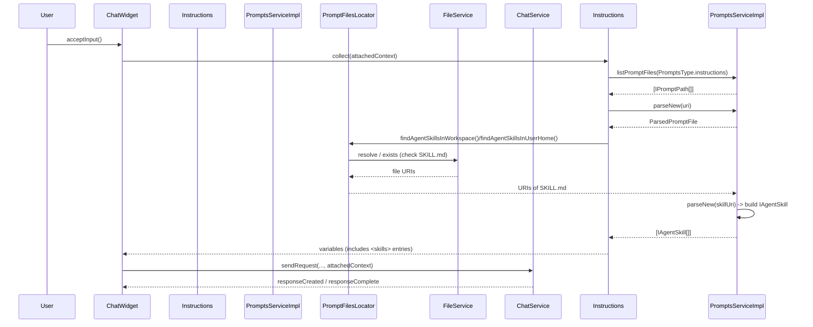

# AGENT Skill 調査まとめ

## User
- `AGENT Skill` の実行パスと概要を調査してほしい。
- 調査に基づいて、Mermaid 図（少なくとも `classDiagram` と `sequenceDiagram`）を作成してほしい。図は適度に省略して主要コンポーネントと相互作用のみ含めること。

## Assistant

### 概要（調査結果）
- 設定 `chat.useAgentSkills` (`PromptsConfig.USE_AGENT_SKILLS`) が有効な場合にのみ `findAgentSkills` が動作する。デフォルトは無効（experimental）。
- スキル探索はワークスペース内とユーザーホーム内の既定フォルダを参照する：ワークスペース側は `.github/skills` / `.claude/skills`、ユーザ側は `~/.copilot/skills` / `~/.claude/skills`。各スキルはサブフォルダ内の `SKILL.md` を含む想定。
- ファイル検出は `PromptFilesLocator`（utils/promptFilesLocator.ts）が行い、`PromptsServiceImpl.findAgentSkills` が `SKILL.md` をパースして `IAgentSkill` エントリ（uri, type, name, description）を生成する。生成過程で名前・説明のサニタイズと長さ制限、重複除外、パース失敗のロギングが行われる。
- 実行時フロー：ユーザーが入力を送信すると `ChatWidget.acceptInput()` → `_autoAttachInstructions()` を呼び、`ComputeAutomaticInstructions.collect()` が動き、内部で `IPromptsService` の `listPromptFiles` / `findAgentSkills` を呼んでスキル一覧を取得する。取得したスキルは `<skills>` ブロックとして要求コンテキスト変数に追加され、必要に応じて `read` ツールで `SKILL.md` の中身を取得して参照させるパターンになっている。
- テレメトリ：`findAgentSkills` は `agentSkillsFound`、`ComputeAutomaticInstructions` は `instructionsCollected` といったイベントで集計情報を送る。

### 重要なクラスと主要メソッド（要約）
- `ChatWidget` — ユーザー入力受け取り、`_autoAttachInstructions` を呼ぶ主体。主な呼び出し: `acceptInput()`, `_autoAttachInstructions()`。
- `ComputeAutomaticInstructions` — 指示ファイルや AGENTS.md、スキルを収集して要求コンテキストに追加する。主な呼び出し: `collect()`, `addApplyingInstructions()`, `_addAgentInstructions()`。
- `PromptsServiceImpl` — プロンプト/指示/エージェント/スキルの列挙・パースを行うサービス実装。主な呼び出し: `listPromptFiles()`, `parseNew()`, `findAgentSkills()`。
- `PromptFilesLocator` — ファイルシステム上で `SKILL.md` やプロンプトファイルを探索するユーティリティ。
- `ChatRequestVariableSet` — 収集した指示やスキルを表す変数集合。

### Mermaid 図 — クラス図（分割）

### Mermaid 図 — シーケンス図（省略版）

### Mermaid 図 — シーケンス図（詳細版）

### 参照ファイル
- [src/vs/workbench/contrib/chat/browser/chatWidget.ts](src/vs/workbench/contrib/chat/browser/chatWidget.ts): `ChatWidget` 実装、入力受け取りと `_autoAttachInstructions` 呼び出し箇所。
- [src/vs/workbench/contrib/chat/common/promptSyntax/computeAutomaticInstructions.ts](src/vs/workbench/contrib/chat/common/promptSyntax/computeAutomaticInstructions.ts): 指示・スキル収集のロジック。
- [src/vs/workbench/contrib/chat/common/promptSyntax/service/promptsServiceImpl.ts](src/vs/workbench/contrib/chat/common/promptSyntax/service/promptsServiceImpl.ts): `findAgentSkills` の実装とスキルファイルのパース/サニタイズ処理。
- [src/vs/workbench/contrib/chat/common/promptSyntax/utils/promptFilesLocator.ts](src/vs/workbench/contrib/chat/common/promptSyntax/utils/promptFilesLocator.ts): `SKILL.md` を探索するユーティリティ。
- [src/vs/workbench/contrib/chat/common/promptSyntax/config/promptFileLocations.ts](src/vs/workbench/contrib/chat/common/promptSyntax/config/promptFileLocations.ts): スキル検索の既定ディレクトリ定義。
- [src/vs/workbench/contrib/chat/common/promptSyntax/config/config.ts](src/vs/workbench/contrib/chat/common/promptSyntax/config/config.ts): `chat.useAgentSkills` 等の設定キー定義。
- [src/vs/workbench/contrib/chat/browser/chat.contribution.ts](src/vs/workbench/contrib/chat/browser/chat.contribution.ts): 設定項目の説明とデフォルト。
- [AGENTS.md](AGENTS.md): ワークスペース内の AGENTS.md に関する参照（ドキュメント）。

