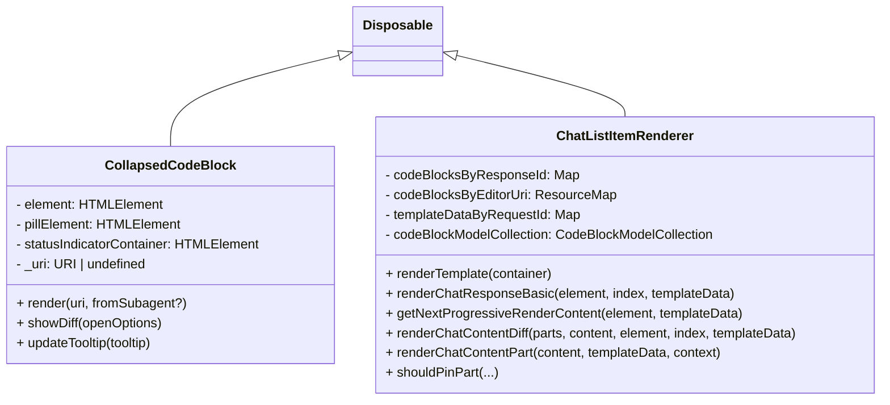
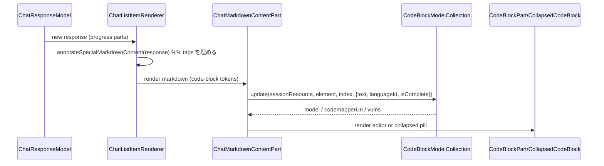
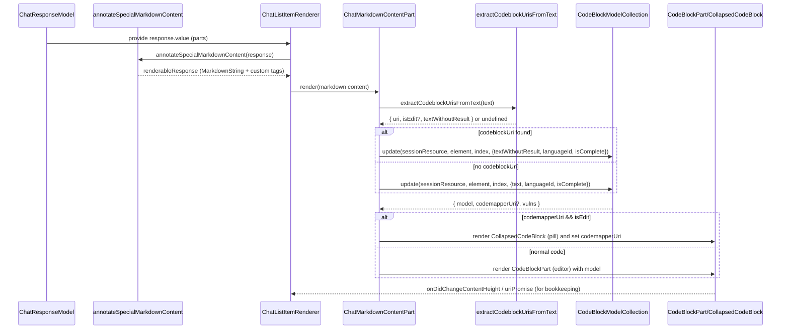

**コードブロックの流れ**
- バックエンドが `IChatResponseCodeblockUriPart` で `{ uri, isEdit, undoStopId }` を渡すと、`annotateSpecialMarkdownContent` がそれを `<vscode_codeblock_uri…>` というテキストマークアップに変換して Markdown に埋め込み、各 `inlineReferences` と `inlineReference` のラベルも同じルールでマージするため、あとは通常の Markdown パーサーに渡すだけの状態にする仕組みになっている。[src/vs/workbench/contrib/chat/common/chatService/chatService.ts#L250-L291][src/vs/workbench/contrib/chat/common/widget/annotations.ts#L16-L111]
- `ChatMarkdownContentPart` の `codeBlockRendererSync` はコードブロックの文字列に `<vscode_codeblock_uri>` が含まれているかを `extractCodeblockUrisFromText` でチェックし、URI や `isEdit` を取り出して `CodeBlockModelCollection` に保存しつつ、必要なら改行以降の差分を `parseUnifiedDiff` などで処理する。編集系コマンドなら `codemapperUri` をもった `CollapsedCodeBlock`（編集中の pill）を出す、普通のコードなら `CodeBlockPart` をレンダリングする。住所としてはコードブロックのレンダリング（`codeBlockInfo`）に `vulns`/`codemapperUri`/`chatSessionResource` を渡し、レンダラーは結果の URI でツールバーやフォーカス・コマンドを補強する。[src/vs/workbench/contrib/chat/browser/widget/chatContentParts/chatMarkdownContentPart.ts#L153-L443]
- `CodeBlockModelCollection` はセッション・チャット・インデックスでモデルをキー化し、最大 100 モデルを保持する。`update`/`updateSync` は `extractVulnerabilitiesFromText` と `extractCodeblockUrisFromText` を順に呼んで、タグや脆弱性情報を削除した生テキストを `ITextModel` に差し替えたり append したりする。`codemapperUri` は `CodeBlockPart` のコンテキスト（編集用 URI）として `toolbar` や `resourceContextKey` に渡され、ビルドした `CollapsedCodeBlock` でも同じ URI を描画し続ける。[src/vs/workbench/contrib/chat/common/widget/codeBlockModelCollection.ts#L34-L206][src/vs/workbench/contrib/chat/browser/widget/chatContentParts/codeBlockPart.ts#L460-L520]

**アノテーションの意味**
- Markdown 内の `markdownVuln` は `annotateSpecialMarkdownContent` で `<vscode_annotation details='…'>` というタグで包まれ、`extractVulnerabilitiesFromText` はそのタグを正規表現で順に探して `IMarkdownVulnerability`（開始/終了行・列を含む）を復元、元データからタグを除去して新しいテキストを返す。これによって脆弱性データはコードブロックのレンダー前に構造的に抽出される。[src/vs/workbench/contrib/chat/common/widget/annotations.ts#L42-L158]
- `CodeBlockModelCollection.updateInternal` ではその `vulns` を `entry.vulns` に保存し、対応するコードブロックが描画されるときに `CodeBlockPart` のボタンや `vulnerabilitiesListExpanded` で描画/ARIA を制御する。レンダリング中に `codeblockHasClosingBackticks` でストリーミング完了を判定し、編集パネルと通常コードとの切り替えも行っている。[src/vs/workbench/contrib/chat/common/widget/codeBlockModelCollection.ts#L181-L205][src/vs/workbench/contrib/chat/browser/widget/chatContentParts/chatMarkdownContentPart.ts#L246-L312]

**annotateSpecial の呼び出し**
- `ChatListRenderer` はレスポンスを描画するとき、`renderChatResponseBasic`（最終描画）と `getNextProgressiveRenderContent`（ストリーミング）で毎回 `annotateSpecialMarkdownContent(element.response.value)` を呼んで Markdown+特殊タグへの変換を行い、結果配列を差分レンダリングに渡す。つまり progressive／final の両方で完全に同じ変換をやり直すため、どちらの経路でも tags/vuln/codeblock の注入が行われる設計になっている。[src/vs/workbench/contrib/chat/browser/widget/chatListRenderer.ts#L734-L1175]
- `hasCodeblockUri`（`hasCodeblockUriTag`）は `markdownContent` の文字列内に `<vscode_codeblock_uri` が含まれているかだけを見て `shouldPinPart` や思考パートへの移行を制御する。つまりアノテーションの有無でツールのピン留めや思考スピナーとの合流が決まっており、タグの精度が UI の振る舞いと直結している。[src/vs/workbench/contrib/chat/browser/widget/chatListRenderer.ts#L1229-L1244][src/vs/workbench/contrib/chat/common/widget/annotations.ts#L118-L127]

**懸念点**
- `<vscode_codeblock_uri>`/`<vscode_annotation>` は Markdown をテキストで再パースする（正規表現）ことでしか復元されないため、例えば Markdown Sanitizer によってタグが消える、あるいはコードブロック外に同じ文字列が出現すると metadata を取り逃がす危険がある。現在のサニタイズ設定 (`ChatContentMarkdownRenderer` の `allowedChatMarkdownHtmlTags` にはカスタムタグが含まれていない) で成り立っているが、将来的な変更で `<vscode_*>` を許可し忘れれば一切のコードブロック URI/脆弱性が失われるリスクがある。[src/vs/workbench/contrib/chat/browser/widget/chatContentMarkdownRenderer.ts#L18-L55][src/vs/workbench/contrib/chat/browser/widget/chatContentParts/chatMarkdownContentPart.ts#L153-L210]
- `annotateSpecialMarkdownContent` は `refIdPool` を毎回 0 から再生成し、呼び出すたびに `MarkdownString` を新規に構築しているので、ストリーミング中（progressive/complete で両方呼ばれる）や再描画で同じ内容が何度も再変換されており、`renderChatResponseBasic`/`getNextProgressiveRenderContent` のそれぞれでコストがかかる。しかも `result` に格納される `inlineReferences` の map や `markdownContent` そのものがリビルドされると、diff 判定が走っても DOM の差分が生じかねない。[src/vs/workbench/contrib/chat/browser/widget/chatListRenderer.ts#L734-L1175]
- `extractCodeblockUrisFromText`/`extractVulnerabilitiesFromText` は文字列操作に依存しているため、例えば正規表現が `<vscode_annotation>` を閉じた状態でしか動作しない以上、タグの一部だけが途中で届くストリーミング（例えば `text` がまだ閉じタグを含まない）では `codemapperUri` が検出できず、結果として `CollapsedCodeBlock` 表示や脆弱性表示が失敗する。現在の実装では失敗しても何も報告されず無視されるため、モデルの追跡やテストが難しくなっている。[src/vs/workbench/contrib/chat/common/widget/annotations.ts#L108-L158][src/vs/workbench/contrib/chat/common/widget/codeBlockModelCollection.ts#L181-L205]

**次のステップ**
1. `IChatResponseCodeblockUriPart`/`markdownVuln` を構造化データで持ち運ぶ方向（たとえば `IChatProgressRenderableResponseContent` に専用のフィールド）に移行して、現在のような `<vscode_*>` マークアップベースの再パースを不要にする。
2. `annotateSpecialMarkdownContent` の再変換頻度を制限するため、`IChatResponseViewModel` 側で変換済み配列をキャッシュし、progressive/final が共通の出力を使い回せるようにすることで `MarkdownString` の再構築と `CodeBlockModelCollection` への二重アップデートを防ぐ。


次は図を出します：目的は前回の説明を視覚化すること（クラス図とシーケンス図）。まず手順を短く示します。
1. 主要クラスと主要フィールド／メソッドを抜き出して classDiagram を作成する。
2. 簡略版と完全版の sequenceDiagram を作る（列が多いので両方用意）。
3. 参照元ファイルへのリンクを付ける。

参照元（抜粋）
- [src/vs/workbench/contrib/chat/common/widget/annotations.ts](src/vs/workbench/contrib/chat/common/widget/annotations.ts#L1-L200)
- [src/vs/workbench/contrib/chat/browser/widget/chatListRenderer.ts](src/vs/workbench/contrib/chat/browser/widget/chatListRenderer.ts#L700-L760)
- [src/vs/workbench/contrib/chat/browser/widget/chatContentParts/chatMarkdownContentPart.ts](src/vs/workbench/contrib/chat/browser/widget/chatContentParts/chatMarkdownContentPart.ts#L140-L220)
- [src/vs/workbench/contrib/chat/common/widget/codeBlockModelCollection.ts](src/vs/workbench/contrib/chat/common/widget/codeBlockModelCollection.ts#L1-L120)
- [src/vs/workbench/contrib/chat/browser/widget/chatContentParts/codeBlockPart.ts](src/vs/workbench/contrib/chat/browser/widget/chatContentParts/codeBlockPart.ts#L1-L120)

classDiagram（分割：主要クラス群 — block 1）
```mermaid
classDiagram
class Disposable {
  +dispose()
}

class CodeBlockModelCollection {
  - _models: Map<string, { model: Promise<IReference>, vulns: IMarkdownVulnerability[], inLanguageId?: string, codemapperUri?: URI, isEdit?: boolean }>
  - maxModelCount: number
  - tag: string
  + get(sessionResource)
  + getOrCreate(sessionResource)
  + update(sessionResource)
  + updateSync(sessionResource)
  + updateInternalCodeBlockEntry(...)
  + getCodeBlockUri(...)
}
Disposable <|-- CodeBlockModelCollection

class ChatMarkdownContentPart {
  - domNode: HTMLElement
  - markdown: IChatMarkdownContent
  - codeblocks: IChatCodeBlockInfo[]
  - mathLayoutParticipants: Set<() => void>
  + renderCodeBlock(...)
  + renderCodeBlockPill(...)
  + hasSameContent(...)
  + layout(...)
  + addDisposable(...)
}
Disposable <|-- ChatMarkdownContentPart

class CodeBlockPart {
  - editor: CodeEditorWidget
  - toolbar: MenuWorkbenchToolBar
  - element: HTMLElement
  - currentCodeBlockData: ICodeBlockData | undefined
  - vulnsListElement: HTMLElement
  + render(data)
  + updateEditor(data)
  + updateContexts(data)
  + layout(width)
  + focus()
}
Disposable <|-- CodeBlockPart
```

classDiagram（分割：補助クラス群 — block 2）


sequenceDiagram（簡略版：列5つ以内）


sequenceDiagram（完全版：詳細ステップ）


ソース参照（図の原典）
- `annotateSpecialMarkdownContent` / `<vscode_codeblock_uri>` / `<vscode_annotation>` 実装: [src/vs/workbench/contrib/chat/common/widget/annotations.ts](src/vs/workbench/contrib/chat/common/widget/annotations.ts#L1-L200)
- レンダラと progressive 描画の呼び出し: [src/vs/workbench/contrib/chat/browser/widget/chatListRenderer.ts](src/vs/workbench/contrib/chat/browser/widget/chatListRenderer.ts#L700-L760)
- Markdown 内での codeblock ハンドリング: [src/vs/workbench/contrib/chat/browser/widget/chatContentParts/chatMarkdownContentPart.ts](src/vs/workbench/contrib/chat/browser/widget/chatContentParts/chatMarkdownContentPart.ts#L140-L220)
- テキストモデルと codemapperUri 管理: [src/vs/workbench/contrib/chat/common/widget/codeBlockModelCollection.ts](src/vs/workbench/contrib/chat/common/widget/codeBlockModelCollection.ts#L1-L120)
- エディタ部品（CodeBlockPart / CollapsedCodeBlock）: [src/vs/workbench/contrib/chat/browser/widget/chatContentParts/codeBlockPart.ts](src/vs/workbench/contrib/chat/browser/widget/chatContentParts/codeBlockPart.ts#L1-L120)

必要なら：これらの図を living doc に貼るか、`annotateSpecialMarkdownContent` の「変換キャッシュ」パッチを作ります。どちらを先に進めますか？
