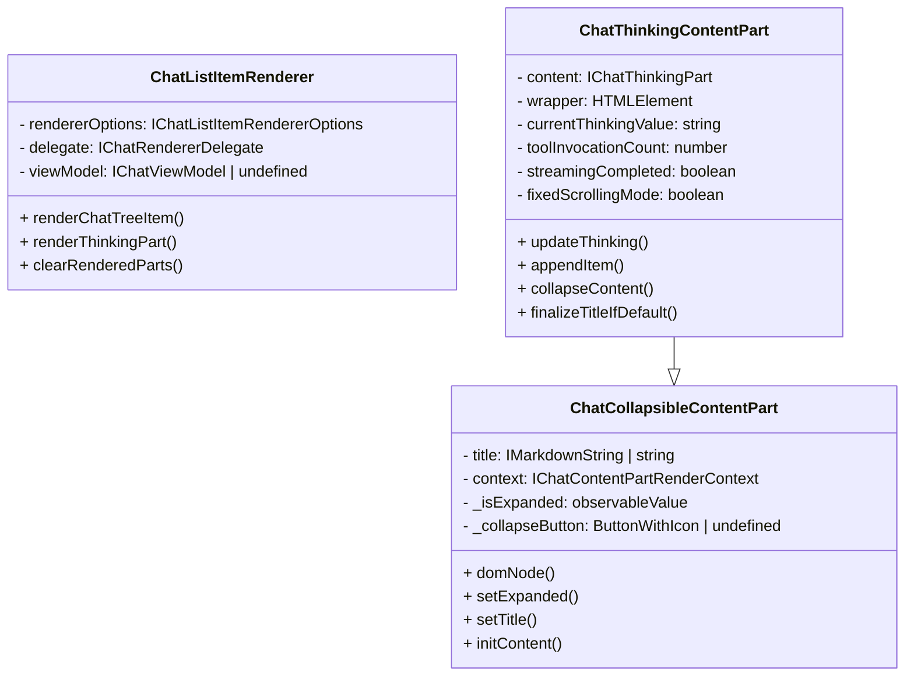
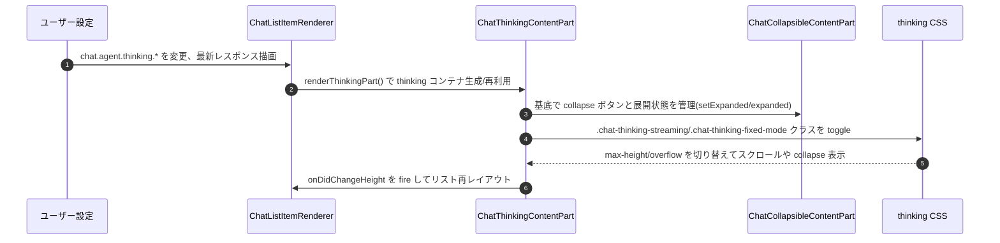

## User
- Chat view の thinking 領域の collapse とスクロールの HTML/CSS 実装、および  thinking 要素内だけでのスクロールと collapse がどのように実現されているかを調査・説明すること。
- 上記の調査結果を整理した mermaid 図（classDiagram と sequenceDiagram）を示すこと。

## Assistant
- `ChatListItemRenderer` は、`chat.agent.thinking.collapsedTools` が `Always` でコードブロックが完了すると、`ChatThinkingContentPart` を生成して `markdownPart.domNode` を `appendItem` で思考ボックスに入れ、コンテントのストリーミング中は既存の `thinking` を再利用するために `renderThinkingPart` を使って差分更新するようになっている（[`src/vs/workbench/contrib/chat/browser/widget/chatListRenderer.ts#L1713-L1744`](src/vs/workbench/contrib/chat/browser/widget/chatListRenderer.ts#L1713-L1744)、[`#L1748-L1789`](src/vs/workbench/contrib/chat/browser/widget/chatListRenderer.ts#L1748-L1789)）。このループで `Thinking` が先端に残り、追加されたコードブロックやツール呼び出しを単一のコラプシブル領域でまとめて扱える。

- 実際の DOM 構造は `ChatCollapsibleContentPart` 側で提供されており、`.chat-used-context` 内に `ButtonWithIcon`（折りたたみボタン）と `initContent()` から返される子コンテンツを入れている（[`chatCollapsibleContentPart.ts#L26-L115`](src/vs/workbench/contrib/chat/browser/widget/chatContentParts/chatCollapsibleContentPart.ts#L26-L115)）。`ChatThinkingContentPart` はその上に `.chat-used-context-list.chat-thinking-collapsible`（線とアイコン付きのコンテナ）を構築し、先頭に `markdown` 用の `.chat-thinking-item` を差し込み、アイテムやツール呼び出しごとに `.chat-thinking-tool-wrapper` を追加している（[`chatThinkingContentPart.ts#L194-L205`](src/vs/workbench/contrib/chat/browser/widget/chatContentParts/chatThinkingContentPart.ts#L194-L205)）。

- 折りたたみのトリガーは `ChatCollapsibleContentPart` の `ButtonWithIcon` で、クリックすると `_isExpanded` を切り替え、`chat-used-context-collapsed` クラスを `.chat-used-context` に付けたり外したりする。`ChatThinkingContentPart` は `ThinkingDisplayMode.Collapsed` なら初期で折りたたみ、`FixedScrolling` 設定なら常に折りたたみつつ `chat-thinking-fixed-mode` クラスを付けてスクロール領域として振る舞わせる（[`chatThinkingContentPart.ts#L122-L205`](src/vs/workbench/contrib/chat/browser/widget/chatContentParts/chatThinkingContentPart.ts#L122-L205)）。ボタンの有効/無効やラベル更新は `setDropdownClickable` や `updateDropdownClickability`（[`#L251-L330`](src/vs/workbench/contrib/chat/browser/widget/chatContentParts/chatThinkingContentPart.ts#L251-L330)）で管理し、アイテムが一つだけでタイトルと同じ内容ならクリックできないようにしている。

- スクロールと展開状態は `ChatThinkingContentPart` が `.wrapper` 要素に `.chat-thinking-streaming`・`.chat-thinking-fixed-mode` を付け、`fixedScrollingMode` 時には `wrapper.scrollTop = wrapper.scrollHeight` で最新までスクロールし、ストリーミング完了時はクラスを剥がす（[`chatThinkingContentPart.ts#L292-L331`](src/vs/workbench/contrib/chat/browser/widget/chatContentParts/chatThinkingContentPart.ts#L292-L331)、[`#L501-L577`](src/vs/workbench/contrib/chat/browser/widget/chatContentParts/chatThinkingContentPart.ts#L501-L577)）。また `finalizeTitleIfDefault` で完了状態を維持し、`streamingCompleted` を true にしてボタンを `Codicon.check` に切り替える。

- CSS では `.chat-used-context-list.chat-thinking-collapsible` に境界線や擬似要素を置き、`.chat-thinking-tool-wrapper`／`.chat-thinking-item` の擬似要素で「思考の連続線」を描き、`.chat-thinking-box` 以下の `.chat-thinking-fixed-mode` 状態で `chat-used-context-collapsed` クラスの有無に応じて `max-height: 200px/overflow: hidden` を切り替えている。ストリーミング中の `.chat-thinking-streaming` では高さ制限がかかり、完了後は `overflow: visible` になるので、折りたたまれている間だけスクロール領域として挙動が変わる（[`chatThinkingContent.css#L11-L171`](src/vs/workbench/contrib/chat/browser/widget/chatContentParts/media/chatThinkingContent.css#L11-L171)）。

- 例えば `chat.agent.thinking.collapsedTools=Always` かつ `chat.agent.thinkingStyle=FixedScrolling` にすると、完了したコードブロックが `ChatThinkingContentPart` に集約され、`.chat-thinking-box` 内で自動スクロールした上で 200px に切り詰められ、折りたたみボタンで展開／折りたたみできるようになる。折りたたみ時はボタンが `chat-used-context-collapsed` を付与して CSS の `max-height` を活かし、展開中は `overflow: visible` で内容全体を表示する。

ご確認・再現のための次のステップ:
1. `chat.agent.thinking.collapsedTools` と `chat.agent.thinkingStyle` をそれぞれ設定して、合成された `thinking` ボックスの折りたたみ＋スクロール挙動が期待どおりか UI で確認。

ソース: [chatThinkingContentPart.ts](src/vs/workbench/contrib/chat/browser/widget/chatContentParts/chatThinkingContentPart.ts#L82-L577)

ソース: [chatListRenderer.ts](src/vs/workbench/contrib/chat/browser/widget/chatListRenderer.ts#L1713-L1789), [chatThinkingContent.css](src/vs/workbench/contrib/chat/browser/widget/chatContentParts/media/chatThinkingContent.css#L11-L170)

## References
- [src/vs/workbench/contrib/chat/browser/widget/chatListRenderer.ts](src/vs/workbench/contrib/chat/browser/widget/chatListRenderer.ts#L1713-L1789) – レンダラ側の thinking 部分の生成・差分処理。
- [src/vs/workbench/contrib/chat/browser/widget/chatContentParts/chatThinkingContentPart.ts](src/vs/workbench/contrib/chat/browser/widget/chatContentParts/chatThinkingContentPart.ts#L82-L577) – thinking コンテンツの DOM・折りたたみロジック。
- [src/vs/workbench/contrib/chat/browser/widget/chatContentParts/chatCollapsibleContentPart.ts](src/vs/workbench/contrib/chat/browser/widget/chatContentParts/chatCollapsibleContentPart.ts#L26-L141) – 共通の collapsible UI ベースクラス。
- [src/vs/workbench/contrib/chat/browser/widget/chatContentParts/media/chatThinkingContent.css](src/vs/workbench/contrib/chat/browser/widget/chatContentParts/media/chatThinkingContent.css#L11-L171) – thinking のスタイルとスクロール制御。
